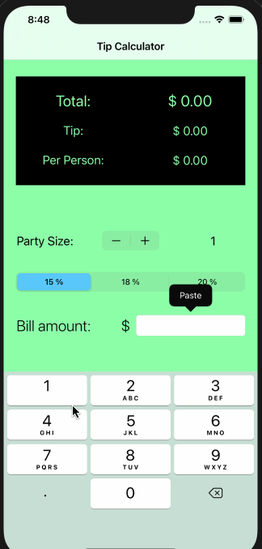

# Pre-work - *Tippy*

**Tippy** is a tip calculator application for iOS.

Submitted by: **Michael Mayaguari**

Time spent: **2** hours spent in total

## User Stories

The following **required** functionality is complete:

* [ ] User can enter a bill amount, choose a tip percentage, and see the tip and total values.
* [ ] User can select between tip percentages by tapping different values on the segmented control and the tip value is updated accordingly

The following **additional** features are implemented:

- [ ] Using a stepper, user can choose the amount of people they want to divide the bill

## Video Walkthrough

Here's a walkthrough of implemented user stories:

## Notes

The stepper has a glitch, it does not get the updated value instantly, but it the amount 
is enetered again then it works well. I'm currently working on fixing this issue

## License

    Copyright [2020] [Michael Mayaguari]

    Licensed under the Apache License, Version 2.0 (the "License");
    you may not use this file except in compliance with the License.
    You may obtain a copy of the License at

        http://www.apache.org/licenses/LICENSE-2.0

    Unless required by applicable law or agreed to in writing, software
    distributed under the License is distributed on an "AS IS" BASIS,
    WITHOUT WARRANTIES OR CONDITIONS OF ANY KIND, either express or implied.
    See the License for the specific language governing permissions and
    limitations under the License.
